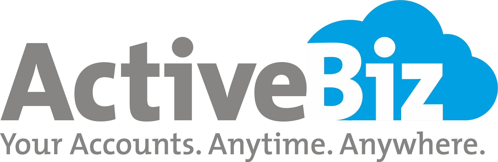

> 
>
> # ActiveBiz Documentation
>
> ## Table Of Contents

1. [Introduction](### Introduction)
   1. [Enterprise Model](./intro/Enterprise-Model.md)
   2. [Featureset](./intro/Features.md)
   3. Begin your journey with ActiveBiz
2. [Accounts](./acc/accounts-basics.md)
   1. [Master](./acc/master/acc-master.md)
      1. [Area](./acc/master/AreaMaster.md)
      2. Route
      3. [Sales Person](./acc/master/SalesPerson.md)
      4. Transporter
      5. Chart Of Accounts
         1. Schedule
         2. Account
            1. General Ledger
            2. Income Accounts
            3. Expense Accounts
            4. Customer Accounts
            5. Supplier Accounts
3. Inventory
4. [How Do I...?](./HowDoI/howdoi-root.md)
5. [Admin Tools](./AdminTools/admintools.md) 
   1. Security
      1. Role
      2. User
      3. Permissions
      4. Default Role Permissions
   2. [Logging](AdminTools/Logging.md)
   3. [Change Tracking](AdminTools/ChangeTracjubg.md)
6. [Support](./support/support.md)
7. [Glossary of Terms](./glossary/glossary-of-terms.md)

### Introduction

> 
 ActiveBiz is an accounting solution based on pricipal of Anytime Anywhere. This is a web based solutions which removes all hastles of native applications management.Web based platform makes this app easy to use & its strong end user support makes it easy and powerful solution that can serve any size of business no matter if you operate in single region or multiple region with more then one branches.
>  In Today's fast pace business enviorment it is always adviseble to implement a solution that works accross geological distances without investing and managing large scalse local infrastructure with team of IT proffesionals & developers. Use our experienced team of proffesionals who are in this field of software development & support since 1995 and works accross multiple platforms and having a deep knowledge accross various industries & complexity to provide sucessful solution to their customers. So, now focus on your own business insted of using your precious time into software development & its challanges.  
>
> ​    